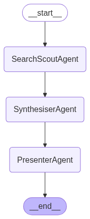
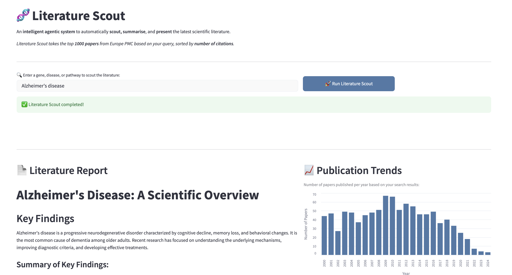

# 🧬 Literature Scout — Multi-Agent Scientific Literature Review Tool

## Project Overview

Literature Scout is a prototype agentic AI system designed to assist scientific and business users in **rapidly scouting a field of literature**.

It takes the top 1000 papers from Europe PMC given your query ((disease, gene, pathway, concept)) sorted by number of descending number of citations

The system:

- Queries the Europe PMC API for recent and relevant papers
- Summarises findings using a Large Language Model (LLM)
- Presents a **structured Markdown report** including:
    - Key findings
    - Papers per year chart
    - Top cited papers
    - Recent papers
    - Downloadable report


The architecture is **agentic**, agents pass information through a state flow and each have clearly defined roles.

The prototype was developed and tested on a **MacBook Air with 8 GB RAM**.


---

## Installation & Setup

### Prerequisites

- OPEN_AI_KEY

### Setup steps

1. **Clone the Repository:**
   ```bash
   git clone https://github.com/alexbohane/literature-scout.git
   cd literature-scout
    ```

2. **Set up OPENAI_API_KEY**

For this step, navigate to the empty .env file and paste your API key.

#### Option 1: Create and activate virtual environment using the command line

1. **Run the following commands**
    ```bash
    # If using conda, first deactivate:
    conda deactivate

    # Create venv
    python3 -m venv .venv

    # Activate venv
    source .venv/bin/activate  # Mac/Linux
    # or
    .venv\Scripts\activate  # Windows

    # Then, you can install the requirements.txt file
    pip install -r requirement.txt

    # From the command line run the following
    streamlit run app.py
    ```

### Option 2: Use Docker

1. **Build Docker Container**
   ```bash
   docker build -t literature-scout .

2. **RUN Docker Container**
   ```bash
   docker run -p 8501:8501 literature-scout

This command runs the container and maps port 8501 of the container to port 8501 on your host, allowing you to access the Streamlit app by navigating to http://localhost:8501 in your browser (recommended not to use Safari).

## Architecture and AI Components

### Overview

The system is designed using a Langgraph agent flow.

In this system, there are three agents,
search_scout_agent: queries the Europe PMC API and returns paper metadata in the state
synthesiser_agent: returns a summary of key findings of the abstract of the papers
presenter_agent: creates a markdown report of key findings and produces two tables of paper results

Below is a mermaid plot of the setup

 

### Use and tradeoffs of AI

Overall the whole system is agentic and works very smoothly. The most useful AI compenent is the synthesiser which uses an LLM to summarise large amounts of text (many abstracts of papers) which would be difficult to do without the use of AI.
The presenter agent is also very useful and uses an LLM to create a report that is remarkably consistent, but that is thanks to setting a low temperature on the LLM and using a good LLM (gpt-4o).

The biggest drawback I found to using AI for this project was some hallucination for the synthesiser agent content and hallucination for the output structure of the presenter agent. What helped was again setting a lower temperature on the model and structuring my prompts into System and Human messages (built in Langgraph functions) which clearly define the agent's role and what input it has available.

## Reflections on AI assisted coding

In this project, ChatGPT 4o was used to help with coding. The main area it struggled in was with Langgraph and Langchain. Since these libraries are so new and constantly evolving, ChatGPT has a tendancy to give code that is from a depracated/old version of Langchain. Instead, the official documentation was relied on heavily to build the workflow in this project.
The Europe PMC querying also required a lot of manual checking, as ChatGPT would very often not follow the correct syntax.

ChatGPT was very good at helping build the API for Europe PMC, and was very helpful setting up the Docker File quickly and with best practices.
The other helpful area was for the UI, the coding of the streamlit app was accelerated thanks to ChatGPT.

I found that ChatGPT acted best as a sounding board. I defined the file structure and architecture as well as which libraries to use before using ChatGPT.

## Demo

Here is a screenshot of the demo

 

